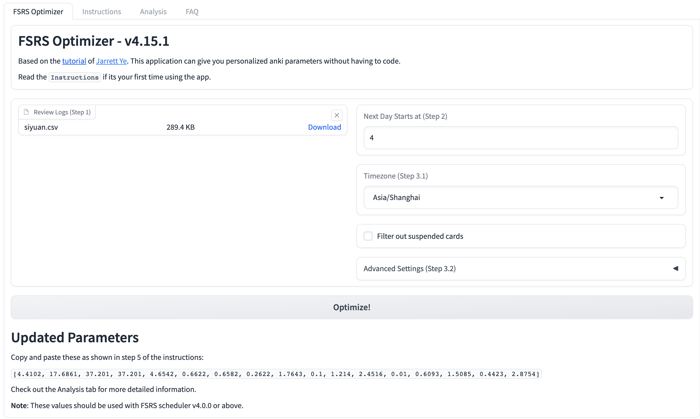
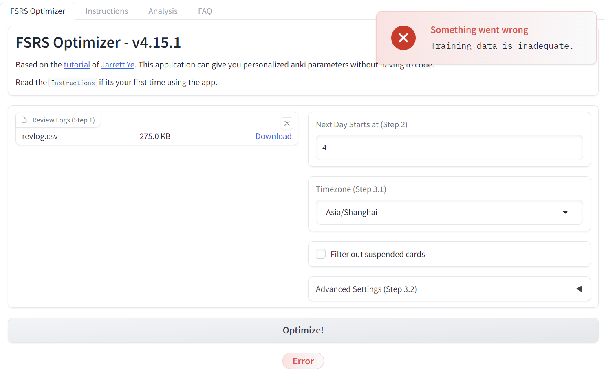
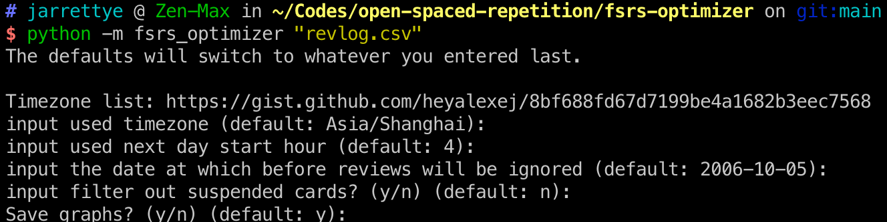

# Plug Functionality

Export the Siyuan Review to the `/data/public/siyuan-plugin-export-revlog' directory

You can then optimize the FSRS algorithm using the [open-spaced-repetition FSRS-optimizer](https://github.com/open-spaced-repetition/FSRS-optimizer ) optimizer

# Optimize FSRS with revlog

## Option 1: (recommend) 

Open [fsrs4anki](https://huggingface.co/spaces/open-spaced-repetition/fsrs4anki_app). Upload the CSV file, select Timezone, click optimize to get optimization parameters.



**报错解决方案**

If there is an error indicating insufficient training data, please refer to [here](https://github.com/open-spaced-repetition/fsrs-optimizer/issues/13) to check revlog.csv file compliance.



## Option 2:

**Installation**

Install [Python](https://www.Python.org/downloads/) and install the package using the following command:

```sh
python -m pip install fsrs-optimizer
```

You should update regularly to ensure that you have the latest version of the FSRS Optimizer:

```sh
python -m pip install fsrs-optimizer --upgrade
```

**Optimization**

Run in the Review Record Export Directory:

```sh
python -m fsrs_optimizer "revlog.csv"
```

Add `-y` [Interactive input parameters are skipped](https://github.com/open-spaced-repetition/fsrs-optimizer/issues/13#issuecomment-1670571816)

```sh
python -m fsrs_optimizer "revlog.csv" -y
```


**Expected function**



